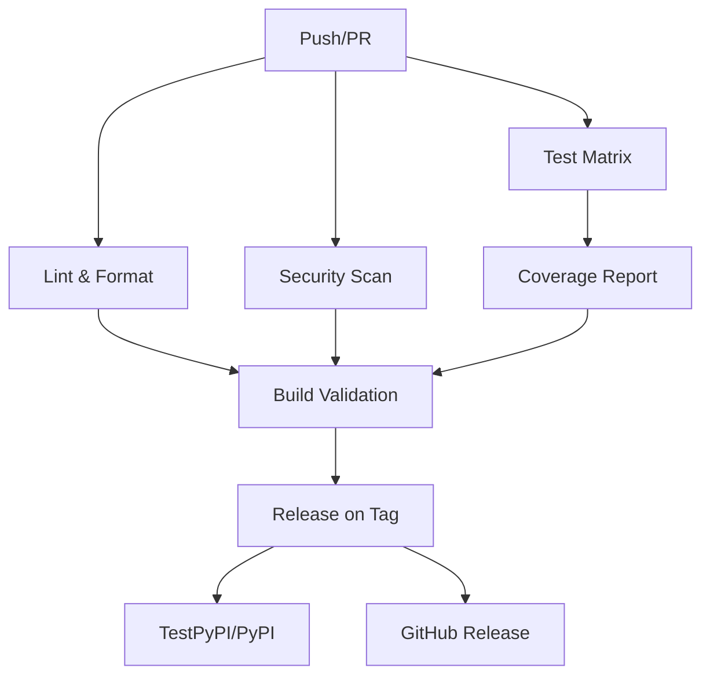

# CI/CD Pipeline Overview

This document provides a comprehensive overview of the LazyScan CI/CD pipeline, including workflow configurations, troubleshooting guides, and maintenance procedures.

## Pipeline Architecture

The LazyScan CI/CD pipeline consists of 6 main workflows that ensure code quality, security, and reliable deployments:



## Workflow Details

### 1. Lint & Format Workflow (`lint-format.yml`)

**Purpose**: Ensures consistent code style and quality
**Triggers**: Push to main/develop, Pull Requests
**Tools**: Ruff, Black, MyPy, Bandit, Safety, Pip-audit, Semgrep

**Steps**:
1. Install dependencies from `requirements-dev.txt`
2. Run Ruff linting with auto-fix comments on PRs
3. Check Black formatting compliance
4. Perform MyPy type checking
5. Execute security scanning with multiple tools
6. Post results as PR comments

**Artifacts**: Lint reports, security findings, type check results

### 2. Test Matrix Workflow (`test-matrix.yml`)

**Purpose**: Validates functionality across platforms and Python versions
**Triggers**: Push to main/develop, Pull Requests
**Matrix**: Python 3.9-3.12 × Ubuntu/macOS/Windows

**Steps**:
1. Set up Python environment with caching
2. Install dependencies
3. Run core test suite with pytest
4. Execute smoke tests for basic functionality
5. Run performance benchmarks
6. Test package installation

**Artifacts**: Test results, performance metrics, benchmark data

### 3. Coverage Workflow (`coverage.yml`)

**Purpose**: Tracks test coverage and enforces minimum thresholds
**Triggers**: Push to main/develop, Pull Requests
**Tools**: pytest-cov, Codecov

**Steps**:
1. Run tests with coverage collection
2. Generate coverage reports (XML, HTML)
3. Upload to Codecov for tracking
4. Enforce minimum coverage threshold (40%)
5. Comment coverage diff on PRs

**Artifacts**: Coverage reports, Codecov uploads

### 4. Security Workflow (`security.yml`)

**Purpose**: Identifies security vulnerabilities and compliance issues
**Triggers**: Push to main/develop, Pull Requests, Scheduled weekly
**Tools**: Bandit, Safety, Pip-audit, Semgrep

**Steps**:
1. Run Bandit for Python security issues
2. Check for known vulnerabilities with Safety
3. Audit pip packages with pip-audit
4. Perform static analysis with Semgrep
5. Upload SARIF results to GitHub Security
6. Generate security summary report

**Artifacts**: Security reports, SARIF uploads, vulnerability alerts

### 5. Build Workflow (`build.yml`)

**Purpose**: Validates package building and installation
**Triggers**: Push to main/develop, Pull Requests
**Tools**: build, twine, check-manifest

**Steps**:
1. Build source distribution (sdist)
2. Build wheel distribution
3. Validate distributions with twine
4. Check package manifest completeness
5. Test installation on multiple platforms
6. Verify CLI functionality post-install

**Artifacts**: Distribution packages, validation reports

### 6. Release Workflow (`release.yml`)

**Purpose**: Automates releases to PyPI and GitHub
**Triggers**: Version tags (`v*`), Manual dispatch
**Tools**: build, twine, OIDC trusted publishing

**Steps**:
1. Validate release version format
2. Run comprehensive pre-release checks
3. Build distribution packages
4. Publish to TestPyPI (pre-releases) or PyPI (stable)
5. Create GitHub release with automated notes
6. Verify post-release functionality

**Artifacts**: Published packages, GitHub releases, release notes

## Configuration Files

### Required Dependencies

- **requirements.txt**: Production dependencies
- **requirements-dev.txt**: Development and CI dependencies
- **pyproject.toml**: Build system and tool configurations
- **pytest.ini**: Test configuration and markers
- **.coveragerc**: Coverage reporting settings
- **MANIFEST.in**: Package manifest for source distribution

### GitHub Actions Configuration

All workflows are stored in `.github/workflows/` with the following structure:

```
.github/workflows/
├── lint-format.yml      # Code quality and formatting
├── test-matrix.yml      # Multi-platform testing
├── coverage.yml         # Coverage tracking
├── security.yml         # Security scanning
├── build.yml           # Package building
└── release.yml         # Automated releases
```

## Environment Requirements

### CI Environment Setup

**Operating Systems**: Ubuntu 22.04, macOS 13, Windows 2022
**Python Versions**: 3.9, 3.10, 3.11, 3.12
**Package Managers**: pip with caching enabled

### Required Secrets and Variables

**Repository Secrets**: None (using OIDC trusted publishing)
**GitHub Environments**:
- `testpypi-publishing`: For pre-release testing
- `pypi-production`: For stable releases (protected)

### OIDC Configuration

**PyPI Trusted Publishers**:
- Repository: `vinayvidyasagar/LazyScan`
- Workflow: `release.yml`
- Environment: Configured per target (TestPyPI/PyPI)

## Quality Gates

### Pull Request Requirements

All PRs must pass these checks before merging:

✅ **Lint & Format**: Ruff and Black compliance
✅ **Type Checking**: MyPy validation
✅ **Security Scan**: No high-severity issues
✅ **Test Matrix**: All tests pass on all platforms
✅ **Coverage**: Maintains or improves coverage
✅ **Build Validation**: Packages build and install correctly

### Branch Protection Rules

**Main Branch Protection**:
- Require status checks before merging
- Require up-to-date branches
- Require pull request reviews (1 reviewer)
- Include administrators in restrictions
- No force pushes or deletions allowed

## Monitoring and Alerting

### GitHub Notifications

**Workflow Failures**: Email notifications to repository maintainers
**Security Alerts**: Dependabot and security scanning alerts
**Coverage Changes**: Codecov comments on PRs

### Health Checks

**Daily**: Security scan scheduled execution
**Weekly**: Dependency vulnerability checks
**Release**: Full pipeline validation on version tags

## Troubleshooting Guide

### Common Issues and Solutions

#### Lint Failures
**Symptom**: Ruff or Black formatting errors
**Solution**: Run `ruff format . && black .` locally before pushing

#### Test Failures
**Symptom**: Pytest failures in CI but passing locally
**Solution**: Check Python version compatibility and environment differences

#### Coverage Drops
**Symptom**: Coverage below minimum threshold
**Solution**: Add tests for new code or adjust threshold if justified

#### Security Findings
**Symptom**: Bandit or Safety alerts
**Solution**: Address vulnerabilities or add exceptions with justification

#### Build Failures
**Symptom**: Package build or installation errors
**Solution**: Verify `pyproject.toml` configuration and dependencies

#### Release Issues
**Symptom**: OIDC authentication failures
**Solution**: Verify trusted publisher configuration on PyPI

### Debug Commands

```bash
# Local CI simulation
pip install -r requirements-dev.txt

# Run all quality checks
ruff check . && ruff format --check .
black --check .
mypy --ignore-missing-imports lazyscan.py
bandit -r .
safety check
pytest --cov=. --cov-fail-under=40

# Build validation
python -m build
twine check dist/*
```

### Log Analysis

**GitHub Actions Logs**: Available for 90 days, searchable by workflow/job
**Codecov Reports**: Historical coverage trends and file-level details
**Security Alerts**: GitHub Security tab with detailed vulnerability info

## Maintenance Procedures

### Regular Updates

**Monthly**:
- Review and update dependencies in `requirements-dev.txt`
- Check for new security scanning tools or rules
- Review branch protection settings

**Quarterly**:
- Update GitHub Actions versions in workflow files
- Review and optimize workflow performance
- Audit OIDC trusted publisher configurations

### Emergency Procedures

**Pipeline Outage**:
1. Check GitHub Actions status page
2. Review recent workflow changes
3. Temporarily disable failing workflows if needed
4. Communicate status to contributors

**Security Incident**:
1. Immediately review security alerts
2. Assess impact and create hotfix if needed
3. Update dependencies or configurations
4. Communicate resolution steps

## Performance Optimization

### Caching Strategy

**Python Dependencies**: Cached by Python version and requirements hash
**Build Artifacts**: Retained for 7-30 days depending on workflow
**Coverage Reports**: Uploaded to external service for persistence

### Workflow Efficiency

**Parallel Execution**: Independent jobs run concurrently
**Conditional Runs**: Skip redundant checks when possible
**Early Termination**: Fail fast on critical errors

## Integration Points

### External Services

**Codecov**: Coverage tracking and PR comments
**PyPI/TestPyPI**: Package distribution and hosting
**GitHub Security**: SARIF upload and vulnerability tracking

### Repository Features

**Branch Protection**: Enforces CI requirements
**Pull Request Templates**: Guides contributor submissions
**Issue Templates**: Structured bug reports and feature requests

## Best Practices

### Workflow Development

1. **Test Locally**: Always validate changes before pushing
2. **Incremental Updates**: Make small, focused workflow changes
3. **Documentation**: Keep this guide updated with changes
4. **Monitoring**: Watch for performance regressions after updates

### Security Considerations

1. **Minimal Permissions**: Use least-privilege access in workflows
2. **Secret Management**: Prefer OIDC over long-lived tokens
3. **Dependency Pinning**: Use specific versions for critical tools
4. **Regular Audits**: Review workflow security quarterly

### Team Collaboration

1. **Clear Feedback**: Ensure CI provides actionable error messages
2. **Fast Feedback**: Optimize for quick developer iteration
3. **Reliable Results**: Minimize flaky tests and false positives
4. **Easy Debugging**: Provide clear logs and debugging information

## References

- [GitHub Actions Documentation](https://docs.github.com/en/actions)
- [PyPI Trusted Publishing](https://docs.pypi.org/trusted-publishers/)
- [OIDC Security](https://docs.github.com/en/actions/deployment/security-hardening-your-deployments/about-security-hardening-with-openid-connect)
- [Codecov Documentation](https://docs.codecov.io/)
- [Ruff Linter](https://docs.astral.sh/ruff/)
- [Black Formatter](https://black.readthedocs.io/)
- [MyPy Type Checker](https://mypy.readthedocs.io/)
- [Bandit Security Linter](https://bandit.readthedocs.io/)
- [Safety Vulnerability Scanner](https://github.com/pyupio/safety)
